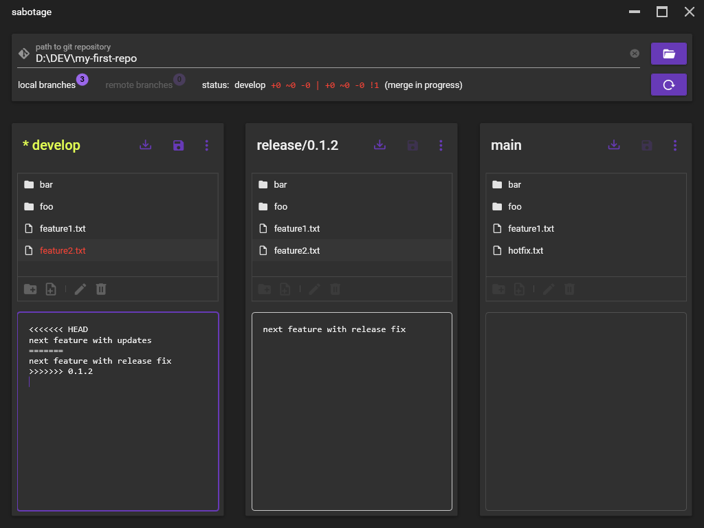

# hyperactive

This is a simple Git GUI for educational purposes. It's main shtick is that it allows you to view the contents of multiple branches in parallel. The goal is to give users new to Git a basic understanding of branches, what they are used for, and how to prevent/resolve merge conflicts.



It's named hyperactive, because it enables you to switch, edit, and merge branches very quickly... and because I couldn't think of a better name. Even though it's fairly robust, I wouldn't recommend using it on production repositories simply for ergonomic reasons.

## features

Only a small subset of Git's features are supported. Here is a list of the things hyperactive can do:

- Open an existing repository or open any directory and let hyperactive initialize a new repository in there.
- Browse the contents of local branches.
- Checkout remote branches to browse them.
- Edit the files of a checked out branch.
- Add/rename/delete files and folders in the working directory.
- Commit all working tree changes (there's no staging area).
- Create a new branch starting from a local branch.
- Rename and delete local branches.
- Merge a branch into the currently checked-out branch.
- Cherry-pick a commit into the currently checked-out branch.
- Working tree status summary in a format similar to [posh-git](https://github.com/dahlbyk/posh-git#git-status-summary-information).

There is no possibility to see the commit history or a commit graph. A graph of branches would certainly be helpful, though. Maybe later.

No fetching from or pushing to remote repositories. Use your favorite real Git client to interact with them.

## building from source

1. Install the [.NET 5.0 SDK](https://dotnet.microsoft.com/download). If you have [chocolatey](https://chocolatey.org/) installed you can execute the command below in PowerShell:

```powershell
PS> choco install dotnet-sdk
```

2. Install [Git](https://git-scm.com/). It's actually not needed for hyperactive, but your life won't be complete without it.

```powershell
PS> choco install git
```

3. Download the [source](https://github.com/bert2/hyperactive/archive/refs/heads/main.zip) or clone it using Git. You did install it, right?

```powershell
PS> git clone https://github.com/bert2/hyperactive.git
```

4. Build & run hyperactive:

```powershell
PS> cd hyperactive
PS> dotnet run -p .\hyperactive\hyperactive.csproj
```

## known issues

- When you want to navigate into a working tree folder you'll have to double click directly on the folder's name or icon. Not on the empty space after or between the two. This is just some WPF ListBox weirdness I haven't found the patience to deal with yet.
- When you open bigger repositories the UI might freeze for a couple of seconds. This is because everything is done in the UI thread and nothing is off-loaded into a background thread. Since hyperactive is only built for smaller toy repositories, I see no need to change that.

## credits

- [LibGit2Sharp](https://github.com/libgit2/libgit2sharp) handles all the Git stuff.
- [MaterialDesignInXAML](https://github.com/MaterialDesignInXAML/MaterialDesignInXamlToolkit) & [MaterialDesignExtensions](https://github.com/spiegelp/MaterialDesignExtensions) make it sexy.
